# Choose your own adventure <br> ⭐★★★★★★★★★

## Background

A text-based choice story. Try to survive till the end.


## Steps

1. output a statement for the background of the story
2. output the first choices the user can pick and allow the to pick
3. check to see what they inputted and output the message depending out their choice

```python
print('"Two paths ahead," it says. "Choose wisely!"')
print()


path = input("Go 'left' toward the dark cave, or 'right' toward the sunny meadow? ")
path = path.lower()

if path == "left":
  print("You approach the dark cave. A sign reads: DRAGON INSIDE!")
```

4. choose a choice and output the second choices to the user
5. check to see what they inputted and output the message depending out their choice
6. mark certain lines as gameover!

```python
path = input("Go 'left' toward the dark cave, or 'right' toward the sunny meadow? ")
path = path.lower()

if path == "left":
    print("You approach the dark cave. A sign reads: DRAGON INSIDE!")

    cave_choice = input("Do you 'go in' or 'run away'? ")
    cave_choice = cave_choice.lower()
    if cave_choice == "go in":
        # DEAD END 1
        print("You tiptoe in and trip over a rock. CRASH!")
        print("The dragon wakes up. You are lost in the cave. GAME OVER!")
    elif cave_choice == "run away":
        print("You sprint away and stumble into a hidden clearing.")
        print("A glowing door is built into a big oak tree.")
```

7. continue adding more levels
